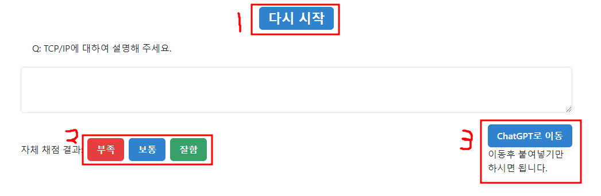

프론트 링크: https://github.com/sungin95/random-sellect-frontend

## 목차

1. [기획 배경](#❓-기획-배경)
2. [기능 소개](#☝️-기능-소개)
3. 설계
   1. 도메인 설계
   2. 유즈케이스
   3. ERD


## ❓ 기획 배경

1. 면접을 준비하는데 지금 답변이 잘하고 있는 건지 알기가 어려웠습니다. 블로그를 보고 열심히 정리해서 답변을 준비를 했지만 이게 맞는건지 잘 모르겠고 핵심적 내용을 잘 전달되었는지 알기가 어려웠습니다. 피드백을 받을 수 있는 방법이 필요했습니다.
2. 스터디를 운영하기에는 각자 정해진 시간을 맞추는 것도 힘들었고, 각자 공부 방향도 조금씩 틀리고, 서로 발표를 꺼려하는 분위기가 있었습니다. 또한 잘했다고 말하기 쉽지만 답변이 좋지 못하다는 이야기는 하기 힘들었습니다.
3. 각자 본인에게 어려운 질문이 다른데. 이걸 개인에게 맞추어 줄 수 있는 시스템이 필요하다고 생각했습니다.

이런 고민을 하던 시기에 ChatGPT활용법이 퍼지기 시작했고 이걸 활용하자고 생각을 하게 되었습니다. 여기에 편의성과 활용성을 추가하기 위해 랜덤 질문 기능, 채점 기능, 복사 기능을 추가 하였습니다.

# **☝️ 기능 소개**



1. 랜덤 질문 기능: 질문지를 선택하면 한개가 무작위로 나옵니다. 이때 중요도를 설정할 수 있는데. 중요도가 높을 수록 나올 확률이 올라갑니다.

ex) A,B,C가 있을때 중요도가 각각 5,3,2 라면 A가 나올 확률은 50%, B가 나올 확률 30%, C가 나올 확률 20%가 됩니다.

1. 채점 기능: "부족", "보통", "잘함" 3개의 버튼을 만들어서 부족하면 중요도를 1증가, 보통은 그대로, 잘함은 중요도 1감소하게 만들어 스스로 채점을 하며 나오는 확률을 조절 할 수 있게 하였습니다.
2. 복사 기능: ChatGPT가 바로 피드백을 할 수 있도록 복사기능을 설정 해 놨습니다.

ex) Q: 웹 사이트 만드신 이유가 뭔가요?

생각한 걸 직접 만들어 보는 개발자가 되겠다는 다짐을 지키기 위해서 입니다!!!

복사 내용: 면접 상황을 가정했을 때 "웹 사이트 만드신 이유가 뭔가요?"라는 질문에 이렇게 답했어 "생각한 걸 직접 만들어 보는 개발자가 되겠다는 다짐을 지키기 위해서 입니다!!!" 피드백 해줘


# 설계

## 도메인 설계


## 유즈케이스


## ERD


# 👨 목표: 기대 효과(USER)

- ChatGPT를 활용하여 자신이 이해한 내용을 글로 정리하고, ChatGPT가 피드백을 제공하도록 요청할 수 있습니다.
- ChatGPT의 채점 기능을 활용하여 어려워하는 질문 위주로 면접을 대비 할 수 있다.

## 👨‍🔧 기술 스택

---

**FrontEnd `React` `TypeScript` `react-router-dom` `chakra-ui` `tanstack` `Axios` `react-hook-form` `js-cookie` `Nginx`**

---

**BackEnd** **`django`** **`django-rest-framework`** **`django-cors-headers`** **`Nginx`** **`uWSGI`**

---

**Database `MySQL`**

---

**Deploy `AWS EC2`** **`AWS RDS`**

---

## ☄️ 회고 및 트러블 슈팅

---

### **Front-End**

**○ 프론트서버와 백엔드 서버 통신간에 에러**

- HPPTS 프로토콜을 사용하지 않아 생긴 에러
  - HTTP주소로 React에서 Django로 데이터 요청시 거절.
  - SSL인증서를 발급 받은 후 Nginx에 적용
  - 포트번호 443을 열고 Nginx의 80번 포트 서버로 들어오면 443포트로 가도록 설정
- CORS 에러 발생
  - 설정에서 허용 주소를 “.도메인”여기 까지만 적었는데. “www.도메인”까지 적어 줘야 했다.

**○ npm run bulid 시 멈춤 현상 발생**

- 메모리가 부족하면 발생하는 문제(프리티어의 t2.micro는 램이 1기가 밖에 되지 않는다. )

- 우선 파일을 줄이기 위해 bulid시 GENERATE_SOURCEMAP=false 옵션을 추가. 하지만 여전히 부족

- 메모리 스왑을 통해 해결.

- ```
  sudo dd if=/dev/zero of=/mnt/swapfile bs=1M count=2048
  sudo mkswap /mnt/swapfile
  sudo swapon /mnt/swapfile
  ```

### Back**-End**

**○ backend서버에 mysql설치 에러**

- mysqlclient를 설치하기 전에 필요한 파일이 있음
- 해결
  - `sudo apt-get install libmysqlcient-dev -y`
  - `sudo pip install mysqlclient`

**○ 로그인을 해도 프론트에서 로그인이 안됨**

- 쿠키 문제
  - 도메인의 서버 도메인이 달라서 생긴 문제
  - settings에서 쿠키 설정을 줘서 서브 도메인에 상관없도록 만듬
  - ".gpt-is-interviewer.me”

## 💡느낀 점

- 프론트 서버와 백엔드 서버가 원활하게 통신을 하기 위한 것들을 많이 배운 시간이었습니다.
  - 이 이전에는 Django에서 프론트 페이지와 백엔드 페이지를 같이 이용하거나 Django REST Framework를 통해 백엔드 서버만 구현을 하거나 해서 서로 어떻게 연결이 되어 있는지 잘 몰랐는데. 이번에 제대로 배울 수 있어서 좋았습니다.
- 개발 공부에 있어서 자신감을 얻을 수 있었습니다.
  - 그 동안 현업에서는 프론트서버와 백엔드 서버를 따로 운영을 한다고 하는데. 서로 다른 두 서버가 어떻게 하나의 사이트로 동작을 하지? 라는 생각이 있었는데. 직접 해 보니까 그 느낌을 알 수 있었습니다. 이 경험이 앞으로 제 개발 인생에 큰 도움을 줄 경험이 될거 같은 느낌이 들어서 좋았습니다.
  - MySQL을 공부만 하고 적용은 안해봤었는데. 이번에 배포 후 적용 까지 해 봐서 좋았습니다. 앞으로 MySQL workbench를 이용해서 MySQL을 관리하는 법을 배우고 싶어 졌습니다.
- 로망을 처음으로 이루어 보는 순간이었습니다.
  - 저는 개발자라면 “스스로 필요한 사이트를 직접 개발해서 사용하자”라는 로망이 있었습니다. 그런데 이번에 면접을 준비하면서 겪었던 에러 사항을 해결해 주는 웹 사이트를 직접 기획하고 만들고 배포를 하게 되어서 너무 기쁘고 또 사용해 보니 편해서 계속 사용하게 되는거 같습니다.
- 고객 니즈를 파악하는 건 많이 어렵구나 느꼈습니다.
  - 저에겐 너무 필요하고 좋은 웹이라서 매일 사용을 하고 있지만, 다른 친구들에게는 그냥 그런 웹사이트 정도였던 거 같습니다.
- CS지식이 많이 부족하구나 체감한 계기가 되었습니다.
  - 프론트 서버와 백엔드 서버와 통신을 할 때 HTTPS 프로토콜을 사용하지 않으면 거부를 하는 것도 몰랐고, Nginx도 잘 몰라서 넣을 계획이 아니었는데 배포를 하려고 보니 필수 느낌이 나서 일단 넣었고, uWSGI도 백엔드 서버를 24시간 돌아가기 위해 필요하다고 해서 넣었고 그냥 아는 게 거의 없구나 느꼈습니다.
  - 또한 도커에 대해 공부를 할 때 서버에서 이것 저것 설정이 필요한 설정을 하나로 묶어 준다는 말에서 github가 있는데 왜 그런게 필요하지? 생각을 했는데. github에서 못하는 설정이 있구나 알았고 다음에는 도커까지 적용하는 것을 목표로 해야겠다고 생각했습니다.

---
